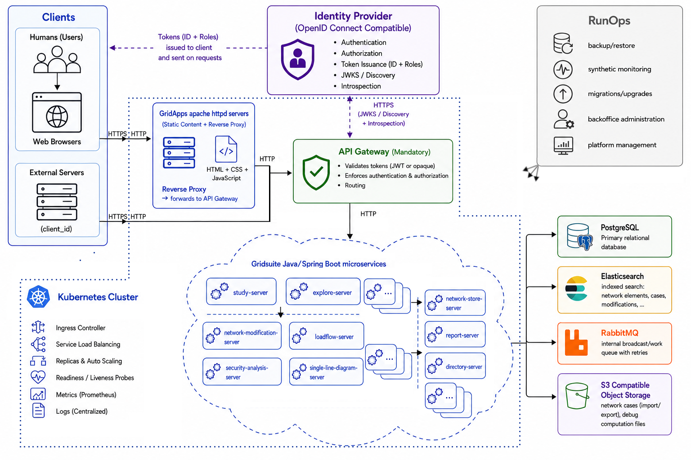

## Architecture

Here is a very high level systems architecture diagram.

We use 2 different databases: PostgreSQL which is the default solution and ElasticSearch for data indexing. In addition to databases, we also use S3 compatible object storage.

Most of the micro-services communications rely on synchronous http request (REST APIs), but we also have asynchronous communication through a RabbitMQ message broker. Back-end access is done from front-end using http call to REST APIs and WebSocket connections for asynchronous updates.

### Technical stack

#### Back-end

All of the micro-services rely mainly on language and frameworks:

- Java 
- Spring Boot / Spring Cloud
- PowSyBl dependencies 

And technical components:

- RabbitMQ 
- PostgreSQL 
- ElasticSearch

The application can be deployed via:

- Kubernetes. 
- Docker compose 

#### Front-end

Front-ends are web applications based on:

- ReactJS 
- React Redux
- Component library: MUI 
- DeckGL (WebGL based) for large power grid visualisation 
- OpenID Connect for authentication

