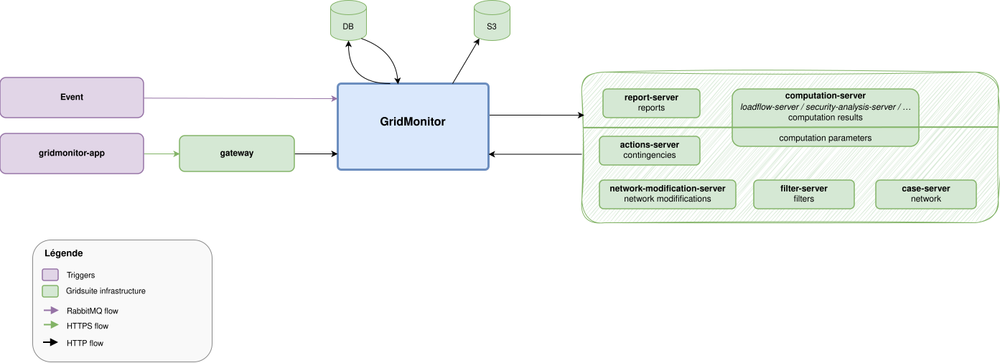
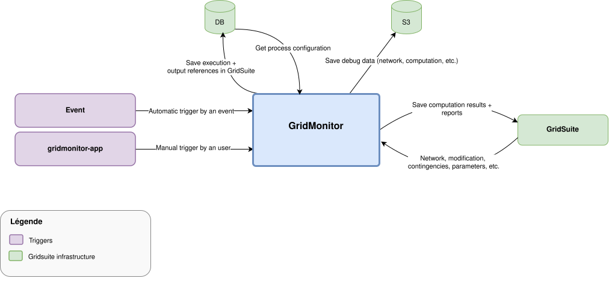
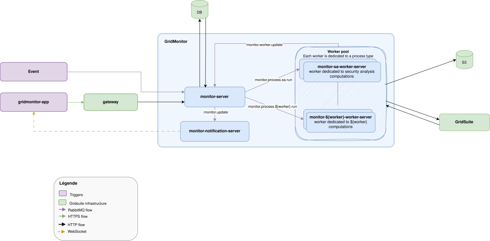

# GridMonitor

GridMonitor is a GridSuite module composed of a frontend and a multi-module Java backend. It schedules, orchestrates, executes, and monitors calculation processes on the electrical grid, such as an N-k security analysis.

The system exposes a REST API to the frontend, delegates calculations to asynchronous workers through RabbitMQ, and persists execution state in PostgreSQL.

## Functional scope

- **Process configuration management**: CRUD operations for parameterized configurations, for example a security-analysis configuration with security-analysis and load-flow parameters, network-modification lists, and contingency lists.
- **Process execution launch**: asynchronous calculation launch for a network case identified by its UUID, with complete traceability of the user, timestamps, and execution environment.
- **Real-time status tracking**: status of each execution and each of its steps.
- **Results and report access**: paginated access to calculation results and log reports.
- **Debug mode**: export of intermediate files, such as XIIDM networks after modifications, to S3 for diagnosis.
- **Execution deletion**: complete cleanup of remote results, reports, and database records.

## Module structure

| Module | Description | Repository |
| --- | --- | --- |
| `gridmonitor-app` | GridMonitor frontend application | [gridsuite/gridmonitor-app](https://github.com/gridsuite/gridmonitor-app) |
| `monitor-core` | GridMonitor backend monorepo | [gridsuite/monitor-core](https://github.com/gridsuite/monitor-core) |
| `monitor-commons` | Shared DTOs, contracts, and common types | Part of `monitor-core` |
| `monitor-server` | Backend-for-frontend and calculation launch through workers | Part of `monitor-core` |
| `monitor-worker-server` | Worker that executes calculations | Part of `monitor-core` |
| `monitor-notification-server` | GridMonitor notification service | [gridsuite/monitor-notification-server](https://github.com/gridsuite/monitor-notification-server) |

## Architecture

### Macro

### Detailed flows and Gridsuite microservices

### GridMonitor

## Messaging (RabbitMQ)

The system uses **Spring Cloud Stream** with the RabbitMQ binder.

| Direction | Module | Binding                            | Queue (destination)                    | Group |
| --- | --- |------------------------------------|----------------------------------------| --- |
| **Publication** | `monitor-server` | `publishRun${worker.process}-out-0` | `monitor.process.${worker.process}.run` | - |
| **Publication** | `monitor-server` | `publishMonitorUpdate-out-0` | `monitor.update`  | - |
| **Consumption** | `monitor-server` | `consumeMonitorWorkerUpdate-in-0`  | `monitor.worker.update`                | `monitorWorkerUpdateGroup` |
| **Consumption** | `monitor-worker-server` | `consumeRun-in-0`                  | `monitor.process.${worker.process}.run` | `process${worker.process}RunGroup` |
| **Publication** | `monitor-worker-server` | `publishMonitorWorkerUpdate-out-0` | `monitor.worker.update`                | - |

The `worker.process` property specializes each worker instance for one process type, such as `securityanalysis`. Multiple workers can therefore be deployed in parallel for different process types.
