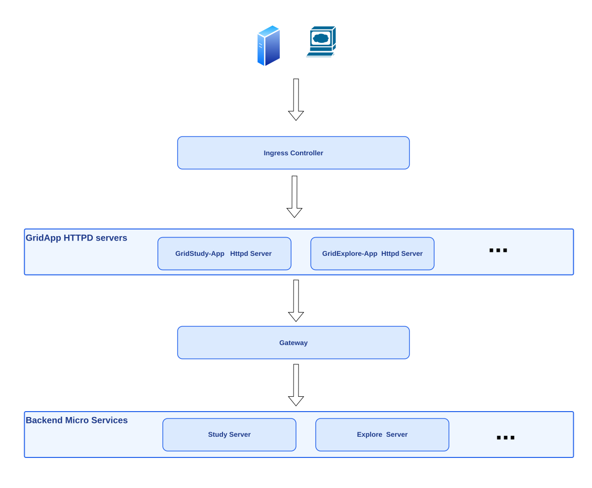
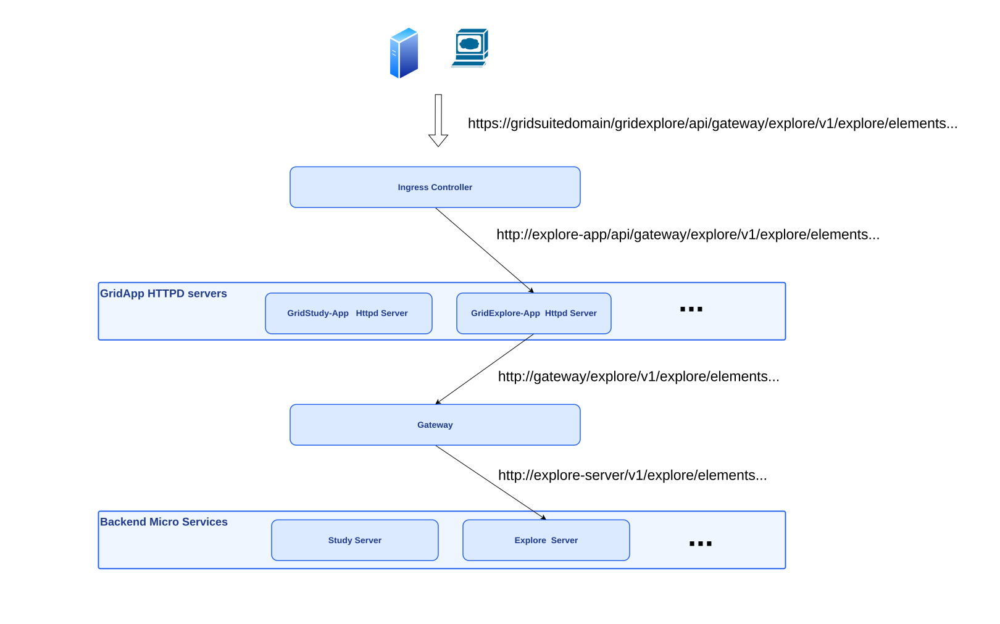

# Request routing

Requests coming from browsers or servers are routed to the appropriate service based on the request URL.

To achieve this, we rely on different layers of routing, each with its own purpose and configuration.

This can be represented as follows:

- The **ingress controller** is the first layer of routing. It is responsible for routing requests to the appropriate service based on the product called (GridStudy, GridExplore, ...).
- The **gridapp httpd servers** are the second layer of routing. They either:
    - route the request to the gateway for API calls
    - or serve static content (HTML, JS, CSS, images, ...)
- The **gateway** is the third layer of routing. It is responsible for:
    - authentication checks
    - routing requests to the appropriate microservice based on the request URL.

For example, if a request is made to `https://gridsuitedomain/gridexplore/api/gateway/explore/v1/explore/elements...`, the routing process would be as follows:

Note how the URL is progressively stripped as each routing prefix is consumed at every step to determine the next destination.

In this example, SSL termination is done at the ingress controller, which then routes the request to the gridapp httpd server. Note that SSL termination can alternatively be handled by an external load balancer for example.

A future improvement could be to route requests directly from the ingress controller to the gateway, bypassing the gridapp httpd servers. The gridapp httpd servers would then only serve static content.
