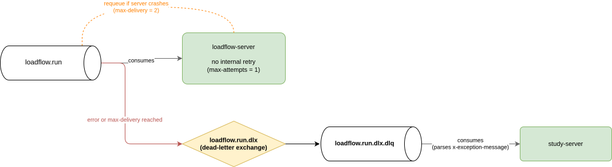

# Error Handling in Message Processing

## Overview

Error handling in message processing has been strengthened. There are 2 main mechanisms to know about: first, the Spring Cloud Stream retry, and second, the RabbitMQ requeue.

---

## Mechanism 1 - Spring Cloud Stream Retry

The first mechanism is provided by spring-cloud-stream. It is a retry system that runs on the server consuming the message. If an exception is thrown during message consumption, spring-cloud-stream will call the consumer multiple times with the same message (on the same server). The goal is to make transient errors invisible to make the system more robust.

The number of retries is defined by the `max-attempts` configuration value, set to `1` to disable this retry system. The rationale is that errors are most of the time business errors and therefore reproducible, making retries ineffective.

This mechanism is entirely internal to spring-cloud-stream. When spring-cloud-stream completes its processing to the end (whether it results in an OK or a KO), it entirely disables the second RabbitMQ requeue mechanism.

---

## Mechanism 2 - RabbitMQ Requeue

The second mechanism is provided by RabbitMQ. It is a requeue system, meaning that when a message is in error, it can be put back into the RabbitMQ queue where it was, so that it can be reprocessed by another consumer.

By default, spring-cloud-stream does not re-queue error messages once its normal processing has completed. This default behavior is kept intentionally.

However, there is one case where a message is systematically put back into the queue: when the server stops unexpectedly (e.g., OOM KILLED, sudden network cut, or spring-cloud-stream unable to reconnect to RabbitMQ), without having responded to RabbitMQ on the processing status of the message.

> **Note:** Independently of spring-cloud-stream, in RabbitMQ, for the requeue count to be correctly tracked, a quorum queue type must be used (`quorum.enabled` set to `true` in the config). When using this type of queue, a maximum delivery count can be defined (`quorum.delivery-limit` set to `2` in the config). The message will be processed N+1 times (N being the delivery-limit) by the consumers.

---

## Dead Letter Queue (DLQ)

Both mechanisms ultimately converge to the same destination and can be handled identically: a message in a special queue called the **dead-letter-queue (DLQ)**. A consumer is wired to this queue and can handle failed messages.

There is a slight difference between the two mechanisms, but it does not prevent handling them in the same way:

- **Mechanism 1 (Spring Cloud Stream retry):** spring-cloud-stream redirects the original message to the DLQ with all its headers, and additionally enriches them with the `x-exception-message` and `x-exception-stacktrace` headers (default parameter `republish-to-dlq` set to `true`).
- **Mechanism 2 (RabbitMQ requeue):** the message will be placed in the DLQ as-is.

Mechanism 1 is the nominal case; mechanism 2 is the fallback. With this system, messages in error are guaranteed to be redirected to the DLQ, while in the nominal case retaining context information about the error. The downside is that the RabbitMQ message in the DLQ must have the same structure as in the source queue.

To send a notification to the frontend with the error message, study-server consumes this DLQ and parses the `x-exception-message` header if it exists.

---

## Architecture Example

Example of the architecture for the loadflow-server:

---

## Naming Conventions

The somewhat particular naming (`loadflow.run.dlx` and `loadflow.run.dlx.dlq`) is due to internal spring-cloud-stream constraints.

For spring-cloud-stream to add the correct DLQ headers when declaring the queue, the `auto-bind-dlq` parameter must be set to `true`. This will create a real exchange and a real queue. Since these elements are declared in both study-server and the computation servers, they can be created by either side, so the definitions must match on both sides.

On the study-server side, we are required to use the `destination` syntax (which must correspond to an exchange) and `group`, where `destination.group` must correspond to a queue. All constraints are therefore satisfied — unique exchange, unique queue, and `exchange.group = queue name` — with the chosen naming.

Furthermore, with the `destination/group` syntax, the created exchange is of type `topic`. However, by default the dead-letter-exchange created is of type `direct`. Since the definitions on both sides must be identical, we have chosen to declare the dead-letter-exchange in the services with a `topic` type.
