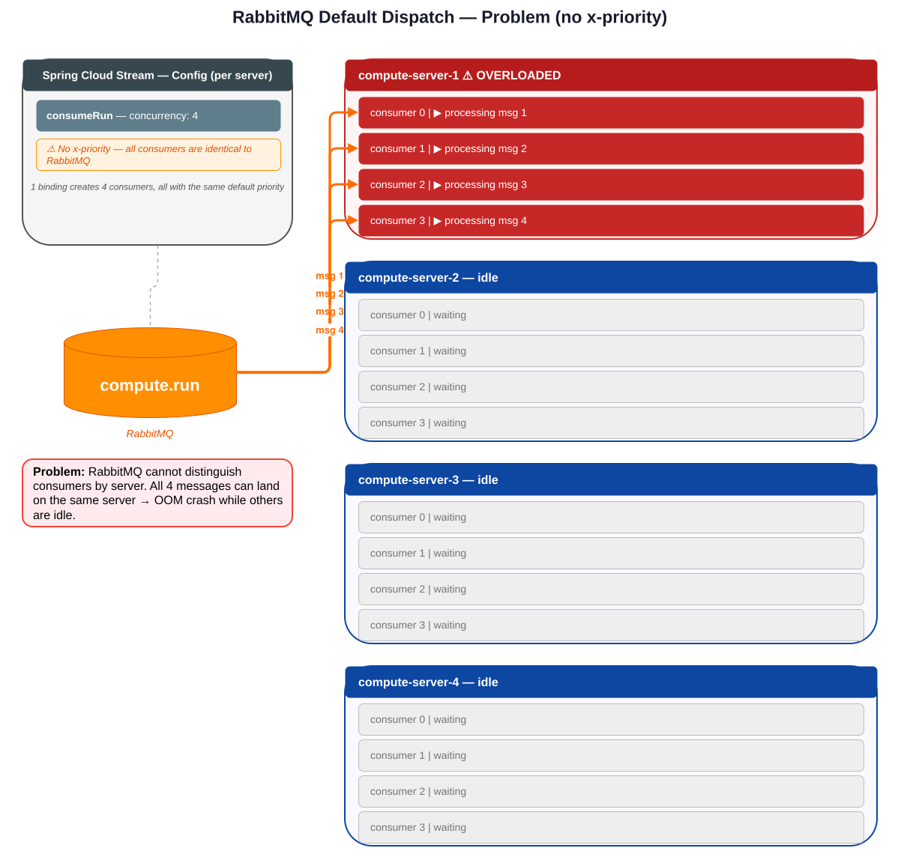
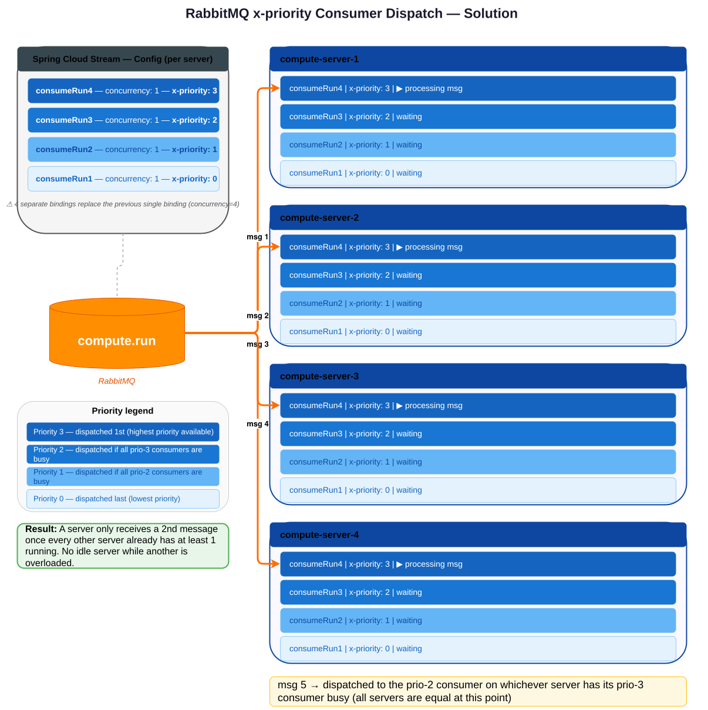

# RabbitMQ Work Queue Load Balancing

## Context

In systems with **multiple replicas** where each replica can process **multiple messages concurrently**, a naive dispatch strategy can lead to severe imbalances: some servers are overloaded while others are completely idle.

---

## The Problem

### Concentrated vs. Spread Dispatch

When RabbitMQ dispatches messages to consumers, it has no awareness of which server instance a consumer belongs to. It only sees individual consumers.

With a default `concurrency=4` setup, all 4 consumers on the same server compete for messages equally. This often results in a **concentrated** pattern where one server handles all concurrent messages while others remain idle.

**Consequences of the concentrated pattern:**

| Risk | Description |
|------|-------------|
| **OOM crash** | All heavy messages land on one server, exhausting its RAM |
| **Blast radius** | A server crash interrupts all its messages simultaneously |
| **Wasted resources** | Other servers are idle despite available capacity |
| **Performance** | Shared resources (network, disk, CPU cache) are under more contention |

### Sizing Trade-off

Regardless of dispatch strategy, there is a fundamental trade-off between two sizing approaches:

| Approach | RAM per server | Behavior |
|----------|---------------|----------|
| **Average-case sizing** | Sized for typical messages | Cheaper, but can crash on a burst of heavy messages |
| **Worst-case sizing** | Sized for all-heavy-messages scenario | Safe, but expensive if heavy messages are rare |

---

## Chosen Strategy

Two main deployment strategies are compared below:

### Strategy A: Fixed replicas, spread dispatch + average-case sizing ✅ *(chosen)*

- A fixed number of replicas is always running (no autoscaling).
- Messages are spread as evenly as possible across replicas using `x-priority`.
- Each server is sized for the **average** message cost, not the worst case.

**Why this is chosen:** In practice, heavy messages are rare (~99% low-load operation). The spread dispatch greatly reduces OOM risk without requiring the overhead of worst-case RAM provisioning on every server at all times.

**Remaining risks:** A burst of simultaneous heavy messages can still exhaust a server. Blast radius (messages lost per server crash) is also larger than with worst-case sizing.

### Strategy B: Autoscaling + spread dispatch + worst-case sizing

- The number of replicas scales dynamically with load.
- Each server is sized for the **worst case** (all-heavy-messages scenario), so no individual server can crash regardless of message mix.
- At low load, fewer servers run, reducing total memory footprint.

Possible scale-up sequences (number of concurrent slots per server, from low to high load):
- `4, 4, 4, 4` (baseline — one size fits all)
- `1, 2, 3, 4` (progressive ramp-up)
- `1, 2, 2, 3, 3, 3, 4, 4, 4, 4`

**Advantages over Strategy A:** No OOM crash regardless of message mix; lower memory usage at low load than fixed worst-case sizing.

**Open questions:**
- Integration with Java warmup time
- Maintaining at least 2 replicas at all times for high availability (node failure resilience)
- Kubernetes support and operational complexity

### Dynamic message sizing (future consideration)

Instead of a fixed message-per-server limit, servers could use a **cost estimation heuristic** (e.g. based on network bus size) to accept a variable number of messages without crashing (e.g. 6 small or 2 large). This would be more efficient but adds system complexity.

---

## Implementation with Spring Cloud Stream

### Problem: Default Behavior

With `concurrency=N` on a Spring Cloud Stream binding, RabbitMQ sees N consumers per server instance but cannot distinguish which server they belong to.

**Result:** N simultaneous heavy messages can all be dispatched to the same server instance, causing an OOM crash while other instances are idle.

> 

### Solution: `x-priority` Consumer Priority

RabbitMQ's [`x-priority`](https://www.rabbitmq.com/docs/consumer-priority#how-to-use) parameter allows consumers to be assigned a priority. When a message arrives, RabbitMQ dispatches it to the **highest-priority available consumer**.

**Priority assignment per server instance (example with N=4):**

| Consumer | Priority |
|----------|----------|
| `consumer 3` | 3 (highest) |
| `consumer 2 ` | 2 |
| `consumer 1 ` | 1 |
| `consumer 0` | 0 (lowest) |

Each server instance has one consumer at each priority level. Since the highest-priority consumer is available on every server, incoming messages are spread across all servers before any server gets a second message.

**Result:** A server only gets a second message once every other server already has at least one message running. No idle servers while one is overloaded.

### Limitations

Spring Cloud Stream does **not** support:
- Customizing individual consumer configuration within a single binding
- Setting `x-priority` per consumer (only a limited set of parameters can be overridden)

**Workaround:** Replace 1 binding with `concurrency=N` by **N separate bindings** each with `concurrency=1`, mapping to N identical beans : e.g. `consumeRun1` → `consumeRun4` for N=4.

> In practice, the concurrency level varies per server: `loadflow-server` uses N=4, while most other computation servers (`security-analysis-server`, `sensitivity-analysis-server`, `shortcircuit-server`, `dynamic-simulation-server`, `voltage-init-server`) use N=2.

> 

The trade-off of this workaround is the AMQP tight coupling, as it requires a direct AMQP dependency, removing the broker-agnostic abstraction provided by Spring Cloud Stream — though this dependency is already present due to the use of the RabbitMQ Dead Letter Queue feature.

Note that the `x-priority` assigned to each bean is determined by Spring and is not configurable — `consumeRun4` may be assigned priority 0 while `consumeRun1` may be assigned priority 3.

The chosen implementation has been done simply using hard coding via beans declaration for consumer definition, if needed this could be made parameterized in the future.

**Relevant issues:**
- [spring-cloud-stream #3122](https://github.com/spring-cloud/spring-cloud-stream/issues/3122)
- [spring-amqp #3092](https://github.com/spring-projects/spring-amqp/issues/3092)
- [spring-cloud-stream #3176](https://github.com/spring-cloud/spring-cloud-stream/issues/3176) (test issues)

**Reference PR:** [gridsuite/loadflow-server #222](https://github.com/gridsuite/loadflow-server/pull/222)
